# RNN_text_generation

**I am trying to generate new text by feeding text data to a single layered LSTM model using KERAS** 

**EXPLANATION** 
import needed libraries 
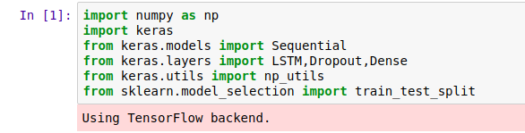

open your data in lower form means no captial characters(C->c,M->m etc...)
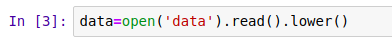

store all the used characters in chars in sorted form 
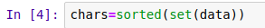

create dictionary of chars to their ids and vice-versa
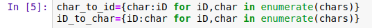

In your dataset your input [1] is first 100 words then 101th is your output 
then [2] is 2-101 words and its output 102nd word and goes on....
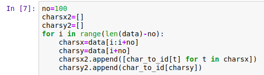

we reshape it it like that so we can feed them to our model 
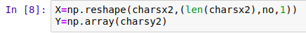

our Y_train is numeric form. convert it to vector form by using to_categorical.
eg. 3 --> (0,0,0,1,0,0,0,0,0,0) 
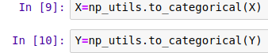

now for our model we 1st use **LSTM** layer whose 1st parameter is its output size. 
there is input then there is hidden unit then there is output.it is size of that output vector 
**do no confuse it with no of hidden units its not that its size of output** 
it is one that connects to dense layer,so in our case dense layer would be 256->10 neural net 
also dropout is to reduce chance of overfitting 
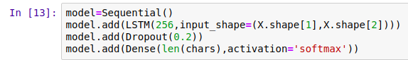

once our model is ready we compile it by choosing a optimizer,loss function if necessary choose a learning rate reduction method as well 
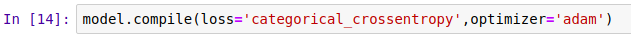

Train the model 
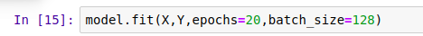

now get a random integer with max as size of your dataset 
choose that as your 1st line of your generated data. 
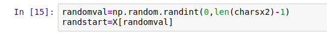

reshape it so you can feed it into your model 
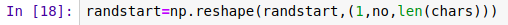

now predict a character from those 100 chars you took randomly 
store it in that random variable now you have 101 chars use last 100 chars repeat the process as much as you like 
there you have it generated data 
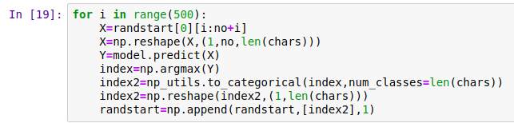

since your output right now is in categorical(one hot vector) reshape it so we can convert it into numeric format 
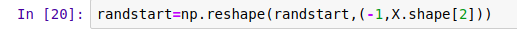

convert it into numeric form by taking maximum of your output 
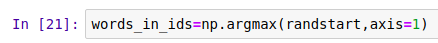

still they are numeric not characters so we convert them into characters. 
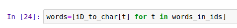

as they are stored in array format we need to first convert them into string format so we can read it. 
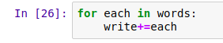

read your generated data 
**you can change \n by next line**
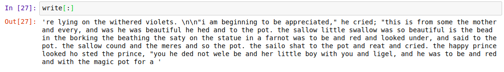

it may seems generated text as gibberish but as we can see it has learn many words and trying to form sentences as data set was quite small too so thats that if it was quite big one it can aswell form paragraphs plus model was very small aswell we can always try **stacked LSTM**. 

if this helped please share :)
